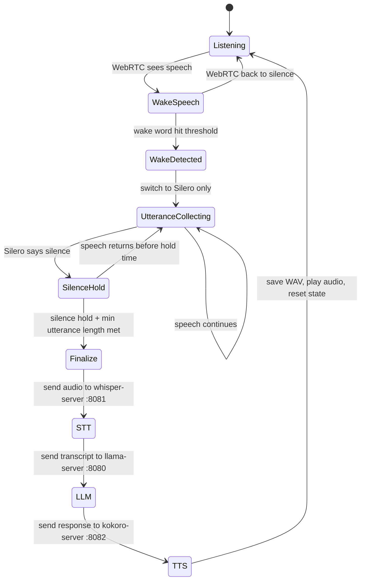

# offline_pocket_voice_assistant

Pocket-sized offline voice assistant for visually impaired users — built for privacy, portability, and low cost. It listens, understands, and speaks back locally with no cloud dependency, using a compact hardware setup designed for everyday carry.

---

## What this does

A fully local, always-on voice assistant pipeline. It listens continuously, filters silence cheaply, detects a wake word, captures the user's command, transcribes it, generates a response, and speaks it back — all on-device with no internet required.

The pipeline has six stages, each doing exactly one job:

1. **WebRTC VAD** — runs continuously, filters obvious silence before anything else wakes up.
2. **openWakeWord** — runs only when WebRTC sees speech, detects the wake word.
3. **Silero VAD** — takes over after wake word, decides precisely when the utterance ends.
4. **Whisper STT** — transcribes the captured audio via a persistent local HTTP server.
5. **Gemma LLM** — generates a response via a persistent local HTTP server.
6. **Kokoro TTS** — synthesizes and plays the spoken reply via a persistent local HTTP server.

---

## Quick start

```bash
# 1. Install system and Python dependencies
make install-system
make install-python-deps

# 2. Run the full pipeline (servers auto-start if not already running)
make run-pipeline
```

The pipeline will:
- Check if the LLM server (port 8080), STT server (port 8081), and TTS server (port 8082) are running.
- Auto-start any that are not running.
- Then start the assistant loop.

---

## Architecture

All three AI stages (STT, LLM, TTS) are hosted as **persistent local HTTP servers**. The pipeline sends HTTP requests to them — no model is loaded per utterance, no subprocess is spawned per request.

```
Microphone
    │
    ▼
WebRTC VAD ──── silence? ──── discard frame
    │ speech
    ▼
openWakeWord ──── no hit? ──── keep listening
    │ wake word detected
    ▼
Silero VAD ──── collecting utterance ──── silence hold met?
    │ yes
    ▼
whisper-server :8081 ──── transcript text
    │
    ▼
llama-server   :8080 ──── response text
    │
    ▼
kokoro-server  :8082 ──── WAV bytes ──── save + play
```

### File map

| File | Location | What it does |
|---|---|---|
| `config.py` | `src/common/` | Single source of truth for all runtime settings |
| `webrtc.py` | `src/vad/` | Continuous silence gate using WebRTC VAD |
| `silero.py` | `src/vad/` | Post-wake utterance end detection using Silero VAD |
| `listen.py` | `src/wakeword/` | Wake word detection using openWakeWord |
| `whisper_cpp.py` | `src/stt/` | STT client — sends WAV to whisper-server, returns transcript |
| `serve_whisper.sh` | `src/stt/` | Starts `whisper-server` on port 8081 |
| `gemma.py` | `src/llm/` | LLM client — sends transcript to llama-server, returns response |
| `serve_gemma.sh` | `src/llm/` | Starts `llama-server` on port 8080 |
| `kokoro.py` | `src/tts/` | TTS client — sends text to kokoro-server, saves WAV and plays it |
| `serve_kokoro.py` | `src/tts/` | Python HTTP server that runs Kokoro TTS on port 8082 |
| `assistant_pipeline.py` | `src/pipeline/` | Main orchestrator — connects all six stages |
| `Makefile` | project root | Short commands for install, server launch, unit checks, and full run |

---

## Repo layout

```text
LICENSE
Makefile
README.md
configs/
    requirements.txt
    wakeword/
        requirements.txt
        environment.yml
        versions.lock.json
docs/
    setup/
        wakeword.md
src/
    common/
        __init__.py
        config.py
    vad/
        webrtc.py
        silero.py
    wakeword/
        listen.py
    stt/
        whisper_cpp.py
        serve_whisper.sh
        stt_test_sample.wav
    llm/
        gemma.py
        serve_gemma.sh
    tts/
        kokoro.py
        serve_kokoro.py
    pipeline/
        assistant_pipeline.py
```

---

## Servers

Three persistent servers keep all models warm in memory. The pipeline sends lightweight HTTP requests to them — no cold start per utterance.

### LLM server — port 8080

Runs `llama-server` from llama.cpp with Gemma 4 E2B.

```bash
make serve-llm
# or manually:
/bin/bash src/llm/serve_gemma.sh
```

Model: `gemma-4-E2B-it-UD-IQ2_M.gguf`
API: OpenAI-compatible `/v1/chat/completions`

### STT server — port 8081

Runs `whisper-server` from whisper.cpp with the tiny English model.

```bash
make serve-stt
# or manually:
/bin/bash src/stt/serve_whisper.sh
```

Model: `ggml-tiny.en.bin`
API: `/inference` — multipart form POST with a WAV file, returns `{ "text": "..." }`

### TTS server — port 8082

Runs a Python `http.server` with Kokoro loaded once at startup.

```bash
make serve-tts
# or manually:
PYTHONPATH=src python src/tts/serve_kokoro.py
```

Model: `kokoro-v1.0.onnx` + `voices.json`
Default voice: `af_heart`
API: `POST /synthesize` — JSON body `{ "text": "...", "voice": "af_heart" }`, returns raw WAV bytes

---

## Pipeline state machine



---

## How it behaves

- WebRTC runs all the time and filters out obvious silence first — it is the cheapest possible guard.
- openWakeWord runs only on frames where WebRTC sees speech — avoids burning CPU on silence.
- Silero takes over after the wake word and is responsible for deciding when the user has finished speaking.
- Each module logs only when its state changes, so the terminal stays clean during normal operation.
- After utterance finalization: audio goes to Whisper → text goes to Gemma → response goes to Kokoro → audio plays back immediately.
- The debug WAV of every utterance is saved to `debug_audio/` when `DEBUG_SAVE_WAV=1`.

---

## Makefile commands

| Command | What it does |
|---|---|
| `make install-system` | Installs `libspeexdsp-dev`, `swig`, `portaudio19-dev` via apt |
| `make install-python-deps` | Installs all Python packages from `configs/requirements.txt` |
| `make serve-llm` | Starts llama-server on port 8080 |
| `make serve-stt` | Starts whisper-server on port 8081 |
| `make serve-tts` | Starts kokoro Python server on port 8082 |
| `make run-pipeline` | Auto-starts all three servers if needed, then runs the full pipeline |
| `make list-devices` | Lists available audio input devices |
| `make check-wakeword` | Runs the wake word listener in isolation |
| `make check-stt` | Tests STT with a local WAV file (`stt_test_sample.wav`) |
| `make check-llm` | Tests LLM by sending a fixed prompt to the running server |
| `make check-tts` | Tests TTS by synthesizing and playing a short sentence |

---

## Configuration

All settings live in `src/common/config.py` as a single `@dataclass`. Every field can be overridden with an environment variable.

### Key settings

| Setting | Default | Env var |
|---|---|---|
| Wake word | `hey_jarvis` | `WAKEWORD` |
| Sample rate | `16000` | `WAKEWORD_SAMPLE_RATE` |
| Wake word threshold | `0.5` | `WAKEWORD_THRESHOLD` |
| Wake word trigger level | `3` | `WAKEWORD_TRIGGER_LEVEL` |
| Silence stop frames | `10` | `SILERO_STOP_SILENCE_FRAMES` |
| Min utterance length | `2000 ms` | `UTTERANCE_MIN_MS` |
| STT server URL | `http://127.0.0.1:8081` | `STT_SERVER_URL` |
| LLM server URL | `http://127.0.0.1:8080` | `LLM_SERVER_URL` |
| TTS server URL | `http://127.0.0.1:8082` | `TTS_SERVER_URL` |
| TTS voice | `af_heart` | `TTS_VOICE` |
| Max LLM tokens | `150` | `LLM_PREDICT_TOKENS` |
| Debug WAV saving | `1` (on) | `DEBUG_SAVE_WAV` |
| Debug output dir | `debug_audio` | `DEBUG_DIR` |

---

## Environment setup

### Known-good environment

| Item | Value |
|---|---|
| OS | Ubuntu 22.04.5 LTS 64-bit |
| Architecture | x86_64 |
| Python | 3.11 |
| NumPy | `< 2` |
| openWakeWord | `0.6.x` |

### Important notes

- Python 3.14 does not work — `tflite-runtime` is unavailable for that version.
- Install `speexdsp-ns` from PyPI, not from old GitHub wheel URLs (causes 404 or compatibility errors).
- Noise suppression is optional for initial wake word validation.

### Conda setup

```bash
conda env create -f configs/wakeword/environment.yml
conda activate wakeword311
```

### Pip setup (alternative)

```bash
python3.11 -m venv .venv
source .venv/bin/activate
python -m pip install -U pip setuptools wheel
pip install -r configs/wakeword/requirements.txt
```

### Validate environment

```bash
python --version
python -c "import openwakeword, numpy; print('ok'); print(numpy.__version__)"
pip show speexdsp-ns
```

---

## Model paths

All model paths are configurable via environment variables. Current defaults:

| Model | Default path |
|---|---|
| Wake word models | `WAKEWORD_MODEL_PATHS` (comma-separated) |
| Whisper STT | `/home/puli/projects/whisper/whisper.cpp/models/ggml-tiny.en.bin` |
| Gemma LLM | `/home/puli/projects/local llm/models.gguf/gemma-4-E2B-it-UD-IQ2_M.gguf` |
| Kokoro ONNX model | `/home/puli/projects/kokoro/kokoro-v1.0.onnx` |
| Kokoro voices | `/home/puli/projects/kokoro/voices.json` |

> **Important:** `kokoro_voices_path` must point to `voices.json` (the JSON file), not `voices-v1.0.bin`. Using the binary file causes a `UnicodeDecodeError` at startup.

---

## Unit testing each stage

Each module can be run standalone with `PYTHONPATH=src`:

```bash
# Test STT with a local WAV file
PYTHONPATH=src python src/stt/whisper_cpp.py src/stt/stt_test_sample.wav

# Test LLM (whisper-server must be running on 8080)
PYTHONPATH=src python src/llm/gemma.py

# Test TTS (kokoro-server must be running on 8082)
PYTHONPATH=src python src/tts/kokoro.py

# Test wake word listener only
PYTHONPATH=src python src/wakeword/listen.py
```

---

## Why this structure

- Each stage does exactly one job and can be tested in isolation.
- `config.py` is the single source of truth — no magic strings scattered across files.
- All three AI models are loaded once as persistent servers — no cold start per utterance.
- HTTP between stages means any stage can be swapped out or moved to a different process without changing the pipeline logic.
- Logs print only on state changes, so noise is low even during long sessions.

---

## Git policy

- Commit `requirements.txt`, `environment.yml`, `versions.lock.json`, and documentation.
- Do not commit virtual environments (`.venv/`), conda environments, downloaded model binaries (`.gguf`, `.onnx`, `.bin`), or audio recordings (`debug_audio/`, `tts_audio/`).
- Keep custom wake word models under a local ignored directory unless releasing versioned models.

---

## Notes

This project is intentionally kept small and local-first. Every design decision favours simplicity, debuggability, and offline operation over features. The current stack runs end-to-end on a Linux desktop and is being progressively adapted for a pocket-sized edge device.
