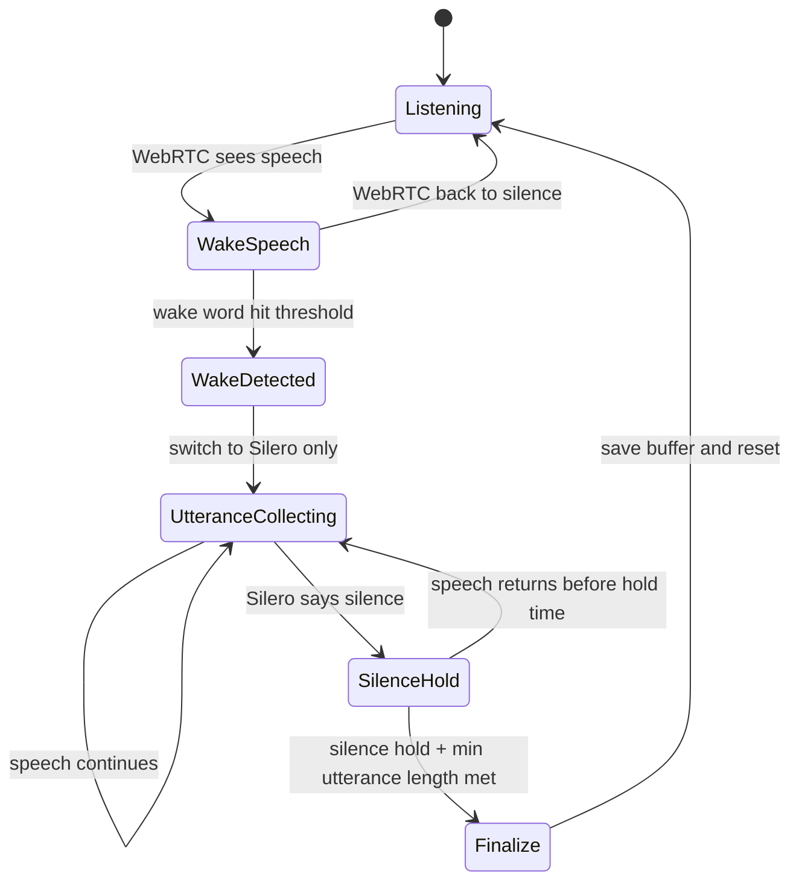

```mermaid
stateDiagram-v2
    [*] --> Listening
    Listening --> WakeSpeech: WebRTC sees speech
    WakeSpeech --> Listening: WebRTC back to silence
    WakeSpeech --> WakeDetected: wake word hit threshold
    WakeDetected --> UtteranceCollecting: switch to Silero only
    UtteranceCollecting --> UtteranceCollecting: speech continues
    UtteranceCollecting --> SilenceHold: Silero says silence
    SilenceHold --> UtteranceCollecting: speech returns before hold time
    SilenceHold --> Finalize: silence hold + min utterance length met
    Finalize --> Listening: save buffer and reset
```
